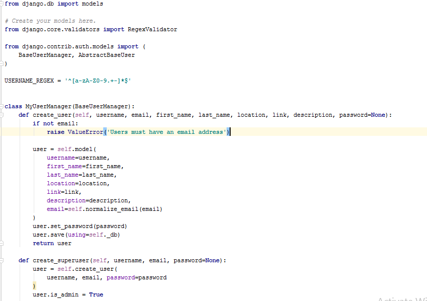
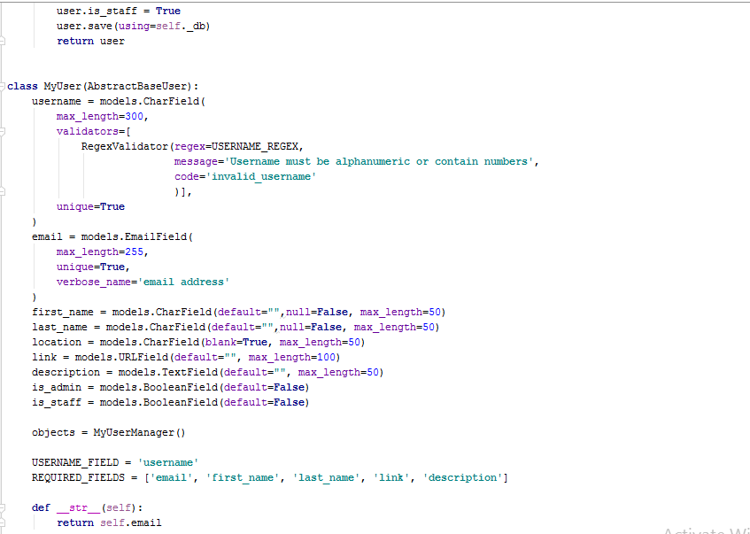
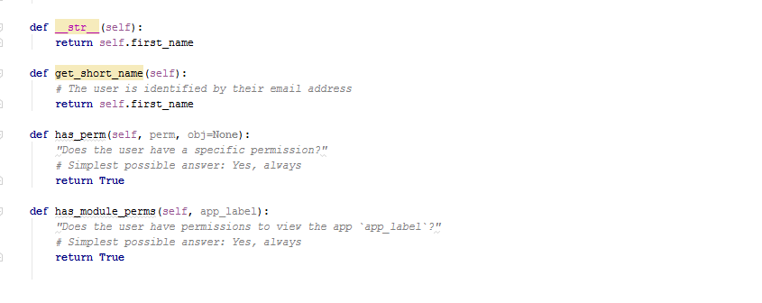
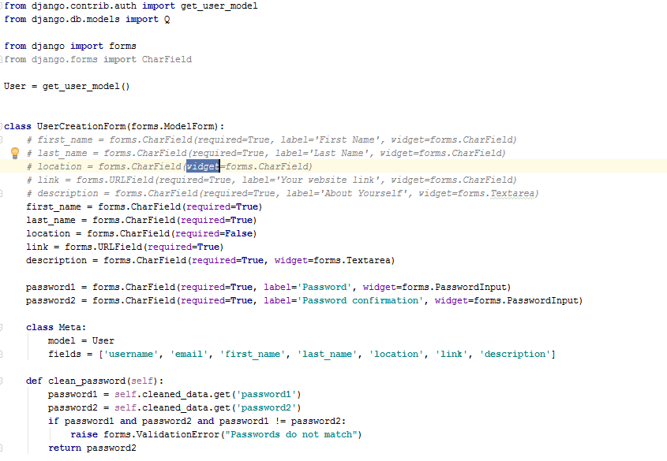
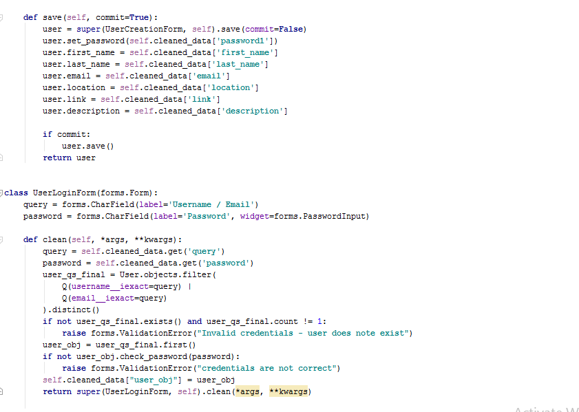
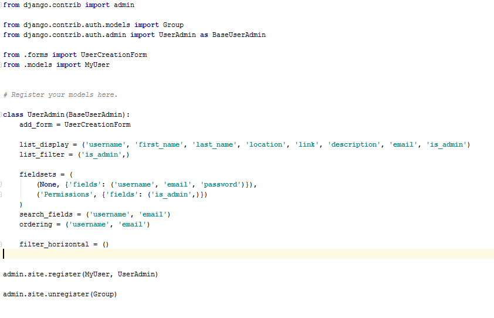
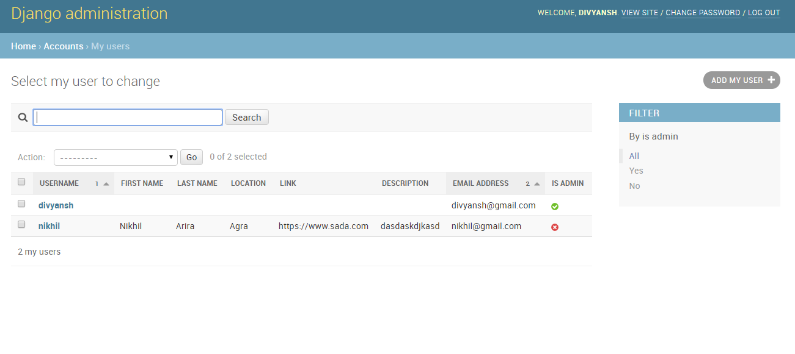
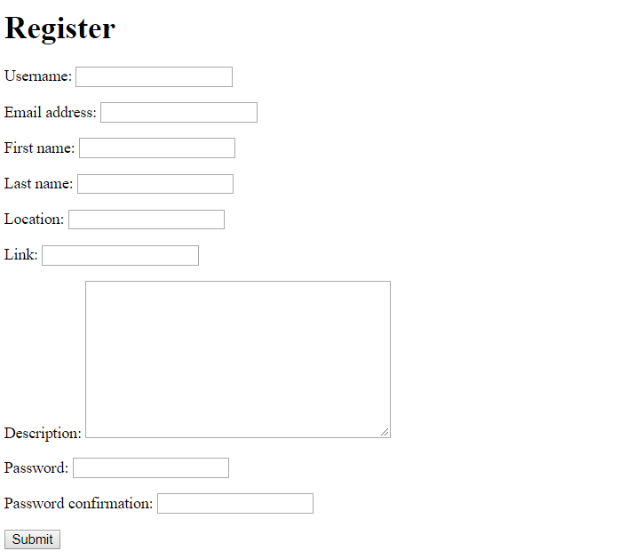

[](https://python.org)
[](https://djangoproject.com)

# Intern Work

Till Now this contains a customized form for user who register and you can see how the models.py created , forms.py created and changes made in admin.py.

## Running the Project Locally

First, clone the repository to your local machine:

```bash
git clone https://github.com/9916103020/intern_work3.git
```

Install the requirements:

```bash
pip install -r requirements.txt
```

Apply the migrations:

```bash
python manage.py migrate
```

Collect the Static folder files:

```bash
python manage.py collectstatic
```

Finally, run the development server:

```bash
python manage.py runserver
```

For registering a user **127.0.0.1:8000/register**
For admin **127.0.0.1:8000/admin**

## Model.py File

In this fully customized form is built removing the default one and you can easily add more fields in it.





## Forms.py

You can easily made required fields and add more form fields and aslo delete fields.




## Admin.py

This is how the admin page look a like and also to check whether all the details of each user stored in database or not.



## Admin Page View



## Register Page View




